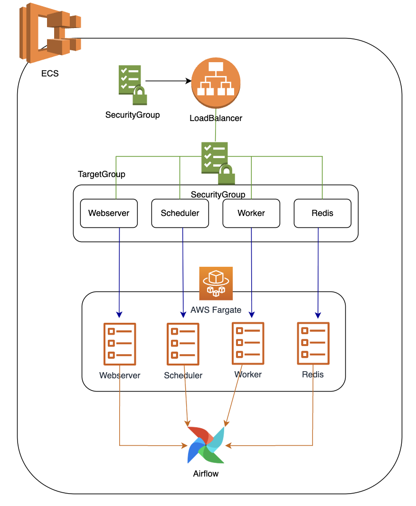
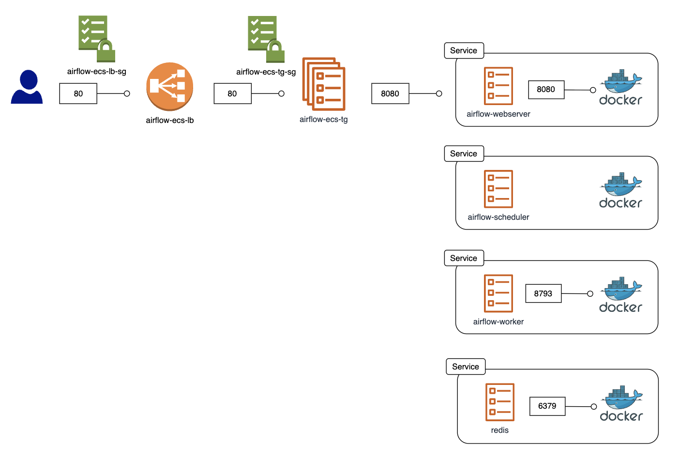

# airflow_on_ecs
Building multi-cluster Airflow using aws ECS

Five main components of Airflow:

- Airflow Webserver
- Airflow Scheduler
- Airflow Worker
- Redis
- AWS RDS Postgres(metadata DB)

I have deployed 4 core Airflow components on ECS in a multi-cluster architecture designed for high scalability and fault tolerance.

